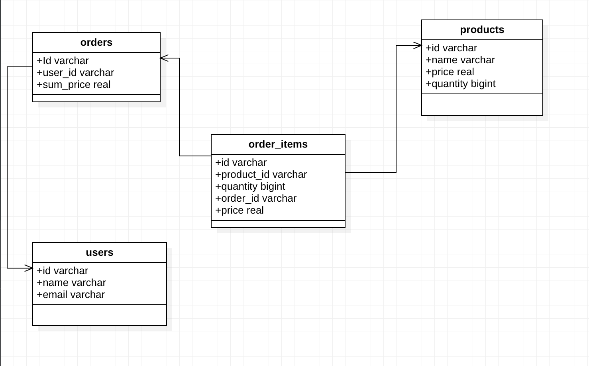

# Training Golang Project

<p align="center">
  
</p>

🚀 Training Golang Project: helps you have an overview of a project's structure and commonly applied technologies. In this project describing the basic point of sale products.


### Tools

Developer experience first:

- ⚡ [Golang](https://go.dev/) for golang language
- 💯 [Go-chi](https://github.com/go-chi/chi) Web framework
- 🔥 [Sqlboiler ORM](https://github.com/volatiletech/sqlboiler)
- 🦺 [Mockery](https://github.com/vektra/mockery) use for generate mock test
- ✅ Postgresql Database
- 💖 Docker and Docker compose
- 🌈 [Migrate](https://github.com/golang-migrate/migrate/tree/master/cmd/migrate) use migrate file sql.


### Tips:
 + go fmt ./...                 => use format code for project
 + go mod vendor                => auto generate vendor package
 + go mod tidy                  => use to clean go.sum and manage packages
 + go vet ./...                 => use to check syntax
 + go test ./...                => run all tests in project


### Requirements

- Go 1.16+ and setup Go env

### Getting started

Run the following command on your docker environment:

```shell
git clone https://github.com/fabatek/training-golang-project.git
cd training-golang-project
docker compose up 
```

Run the following command on your local environment:

```shell
go run cmd/handlers/main.go

Note: make sure
  + export variable ENV in file env.dev
  + config Postgresql
  + config GoPath
```

### Apis in project
  + api create user
```shell
curl --location --request POST 'http://[your_host]/api/v1/users' \
--header 'Content-Type: application/json' \
--data-raw '{
  "name": "thormas",
  "email": "thormas@gmail.com"
}'
```

  + api create product
```shell
curl --location --request POST 'http://[your_host]/api/v1/products' \
--header 'Content-Type: application/json' \
--data-raw '{
  "name": "car",
  "price": 20000,
  "quantity": 10
}'
```

  + api order list products
```shell
curl --location --request POST 'http://[your_host]/api/v1/orders' \
--header 'Content-Type: application/json' \
--data-raw '{
  "user_id": "a2f147ba-0669-4470-96de-7899fc80c5f1",
  "order_item":[
        {
           "product_id":"dfb1b246-f809-462c-89c7-3c88fb209f0c",
           "quantity":3
        }
     ]
}'
```

### Struct project

```shell
.
├── Makefile                      # Make file
├── README.md                     # README file    
├── build                         # Contain file for build and deploy to server
│   └── Dockerfile
├── cmd                           
│   └── handlers
│       ├── main.go
│       └── routes
│           ├── routes.go
│           └── v1                # Forward request apis
├── docker-compose.yml  
├── env.dev
├── go.mod
├── go.sum
├── internal
│   ├── config                    # Config Env or something for project 
│   │   └── db.go
│   ├── controllers               # Handle request and return response
│   ├── databases                 # Communication with database
│   ├── httpbody                  # Define format request/response
│   ├── models                    # Define model for database
│   └── services                  # Handle logic for request
├── migrations
├── mocks                         # Mocks for testing
├── sqlboiler.toml                # config generate ORM 
├── utils                         # Define global code for project
```

### Database design

<p align="center">
  </a>
</p>

### Troubleshooting run project:

  #### How to setup gopath:
  - In terminal: export GOPATH=$HOME/go
  - In terminal: export PATH=$PATH:$(go env GOPATH)/bin

  #### Download and install go migrate:
  - Link: https://github.com/golang-migrate/migrate/tree/master/cmd/migrate
  - In terminal: go get github.com/golang-migrate/migrate/v4

  ##### Generate db/migrations file
  - In terminal: migrate create -ext sql -dir [path_to/migrations] [name_file]  

  ##### Run test
  - Just run a func test: go test -cover -v [path/to/folder] -run [func_test_name]
  - Run all tests in project: go test ./...
